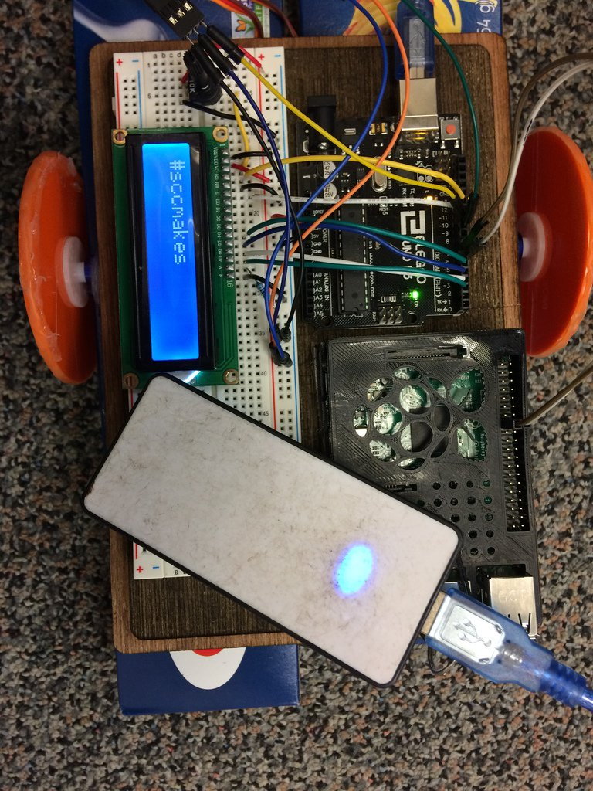

# arduinoTwitterBot
Literal twitter bot to show off at the SCC Makerspace's Grand Opening.  

Currently the Raspberry Pi will read from the hashtag #sccmakes and print the most recent message to the LCD screen via the Arduino.  It will alternate between this and reading commands tweeted @sccmakerbot and responding to them (both via twitter and servo motors on the Arduino).  Surprisingly, the whole operation can run off of one backup battery cellphone charger.   The available commands are 'move', 'left', 'right', and 'stop.' 

If you would like to build your own, the pitwitterduino.scad has the code for the body (export as .svg and import into your laser cutter program) cut out of .2" MDF.  The caster on the front is a pingpong ball holder from https://www.thingiverse.com/thing:636967 and the pi case is from https://www.thingiverse.com/thing:559858 The code and tutorials I referenced are linked in the code.  Enjoy, Jim

